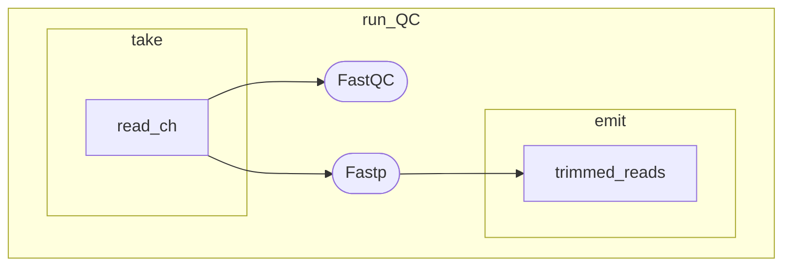

# singularity_streptococcus
A short pipeline to showcase use of singularity containers.

## *Analysis* steps
1. Download WGS reads from SRA with sra-tools
2. QC with FastQC
3. Read trimming with fastp
4. Post trimming FastQC

## Bash version

```
git clone https://github.com/MHryc/singularity_streptococcus.git
cd singularity_streptococcus/ && chmod +x pipeline.sh
./pipeline.sh
```

### Results
Html files created by FastQC and fastp will be stored in `/results` directory

## Nextflow version

Modify the `run.sh` script:

```
nextflow run pipeline.nf -resume \
	--sracode 'SRR32524951' \
	--api_key 'f4b36fd5a919b6f555c90a4b40078dcce408' \
	--adapter_path "$(pwd)/resources/adapter.fa" \
	--ncbi_genome "$(pwd)/resources/streptococus_ncbi.txt" \
	--out 'results/nextflow'
```

```
--scracode      SRA code of reads to download and analyse
--api_key       NCBI API key
--adapter_path  path to FASTA file containing adapter sequence
--ncbi_genome   textfile containing URL of genomic.fna.gz file from NCBI genomes
--out           directory where results will be stored
```

and `./run.sh`

### Workflow structure (DAGs)

#### run_QC DAG



#### main workflow DAG


