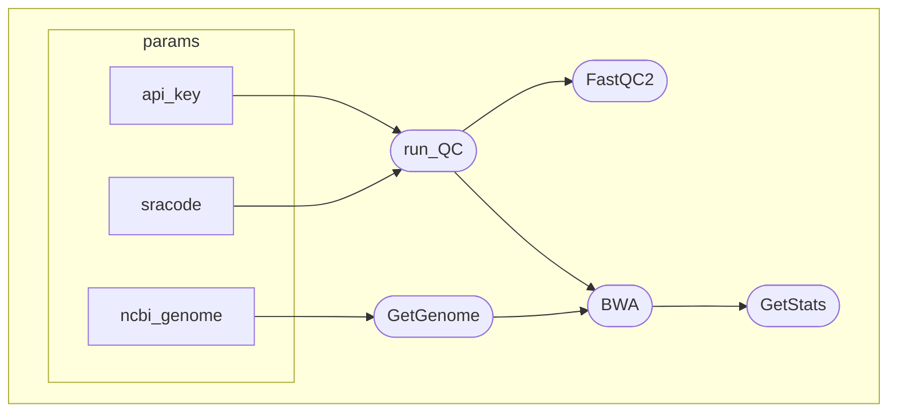

# singularity_streptococcus
A short pipeline to showcase use of singularity containers

## *Analysis* steps
1. Download WGS reads from SRA with sra-tools
2. QC with FastQC
3. Read trimming with fastp
4. Post trimming FastQC

## Running
```
git clone https://github.com/MHryc/singularity_streptococcus.git
cd singularity_streptococcus/ && chmod +x pipeline.sh
./pipeline.sh
```

## Results
Html files created by FastQC and fastp will be stored in `/results` directory

## Workflow DAG

### run_QC DAG


### main workflow DAG


